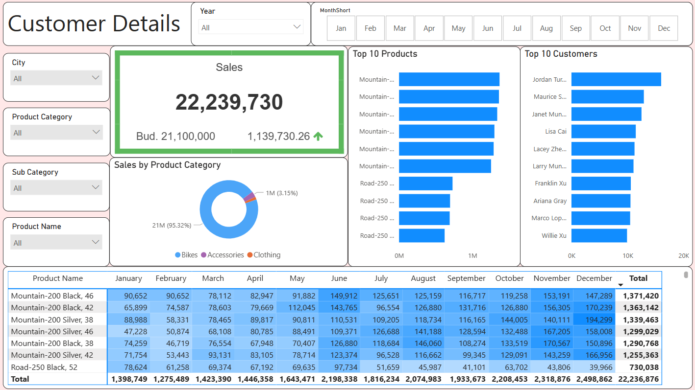
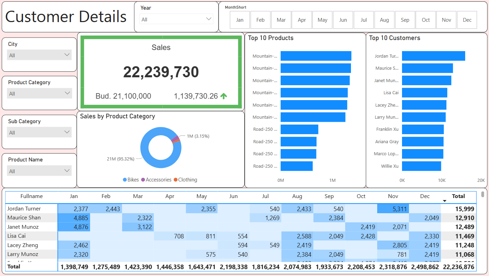

# Business Analysis
Business Demand:

1. Need to improve our **internet sales reports** and move from static reports to **visual dashboards**.
2. Identify **How many products have been sold, what are those products,** to **which clients**, and **how sales have performed over time**.
3. See each **sales person performance** on different products and customers to see if it would be beneficial to be able to filter them.
4. Measure our numbers against **budget** in spreadsheet to compare our values to the performance.
5. The budget is for 2021 and we usually look 2 years back in time when we do analysis of sales.

Business Demand Overview:

- Reporter: Sales Manager
- Value of Change: Visual Dashboards and Improved Sales Reporting or Follow up for the Sales Force
- Necessary Systems: Power BI, CRM System
- Other relevant info: Budgets will be delivered in Excel for 2021

Tasks:

| No #  | Role | Request / Demand  | User Value | Acceptance Criteria |
| ------------- | ------------- | ------------- | ------------- | ------------- |
| 1  | Sales Manager | A Dashboard overview of Internet Sales | Can follow better which customers and products sells the best | A Power BI dashboard which updates data once a day  |
| 2  | Sales Representative | A detailed overview of Internet Sales per Customers  | Can follow up my customers that buys the most | A Power BI dashboard which allows to filter data for each customer |
| 3  | Sales Representative | A detailed overview of Internet Sales per Products | Can follow up my Products that sells the most | A Power BI dashboard which allows to filter data for each Product |
| 4  | Sales Manager | A detailed overview of Internet Sales | Follow Sales over time against budget | A Power BI dashboard with graphs and KPIs comparing against budget. |

## Skills Demonstrated:

* Data Cleansing and Transforming in SQL Server

* Data Visualization using Power BI

## Extract Data:
1. Customer query:
```ruby
--Cleanse DimCustomer Table--
SELECT 
  c.[CustomerKey], 
  c.[FirstName], 
  c.[LastName], 
  c.[FirstName] + ' ' + c.[LastName] as [Fullname], 
  CASE c.[Gender] When 'M' Then 'Male' When 'F' Then 'Female' End as [Gender], 
  c.[DateFirstPurchase], 
  g.[City] -- Joined in Customer City from Geography Table
FROM 
  [AdventureWorksDW2019].[dbo].[DimCustomer] As c 
  Left join [AdventureWorksDW2019].[dbo].[DimGeography] as g ON c.GeographyKey = g.GeographyKey 
ORDER BY 
  CustomerKey ASC --Ordered List by CustomerKey
```
   2. Date query:
```ruby
--Cleanse DimDate Table--
SELECT 
  [DateKey], 
  [FullDateAlternateKey] as Date, 
  [EnglishDayNameOfWeek] as Day, 
  [WeekNumberOfYear] as WeekNo, 
  [EnglishMonthName] as Month, 
  LEFT(EnglishMonthName, 3) as MonthShort, 
  [MonthNumberOfYear] as MonthNo, 
  [CalendarQuarter] as Quarter, 
  [CalendarYear] as Year --[CalendarSemester]
FROM 
  [AdventureWorksDW2019].[dbo].[DimDate] 
WHERE 
  CalendarYear >= 2019
```
   3. Product query:
```ruby
--Cleanse DimProduct--
SELECT 
  Pd.[ProductKey], 
  Pd.[ProductAlternateKey] AS [Product Code], 
  Pd.[EnglishProductName] AS [Product Name], 
  Ps.[EnglishProductSubcategoryName] AS [Sub Category], --Joined in from Subcategiry Table
  Pc.[EnglishProductCategoryName] AS [Product Category], --Joined in from Category Table
  Pd.[Color] AS [Product Color], 
  Pd.[Size] AS [Product Size], 
  Pd.[ProductLine] AS [Product Line], 
  Pd.[ModelName] AS [Product Model Name], 
  Pd.[EnglishDescription] AS [Product Description], 
  isnull (Pd.[Status], 'Outdated') AS [Product Status] 
FROM 
  [AdventureWorksDW2019].[dbo].[DimProduct] AS Pd 
  LEFT JOIN [AdventureWorksDW2019].[dbo].[DimProductSubcategory] AS Ps ON Pd.ProductSubcategoryKey = Ps.ProductSubcategoryKey 
  LEFT JOIN [AdventureWorksDW2019].[dbo].[DimProductCategory] AS Pc ON Ps.ProductCategoryKey = Pc.ProductCategoryKey 
ORDER BY 
  Pd.[ProductKey] ASC
```
   4. Internet Sales query:
```ruby
--Cleanse InternetSales Table--
SELECT 
  [ProductKey], 
  [OrderDateKey], 
  [DueDateKey], 
  [ShipDateKey], 
  [CustomerKey], 
  [SalesOrderNumber], 
  [SalesAmount]
FROM 
  [AdventureWorksDW2019].[dbo].[FactInternetSales] 
WHERE 
  LEFT([OrderDateKey], 4) >= 2019 
ORDER BY 
  [OrderDateKey] ASC
```

## Analysis Dashboards:
### Customer Overview:


### Product Details:


### Customer Details:

